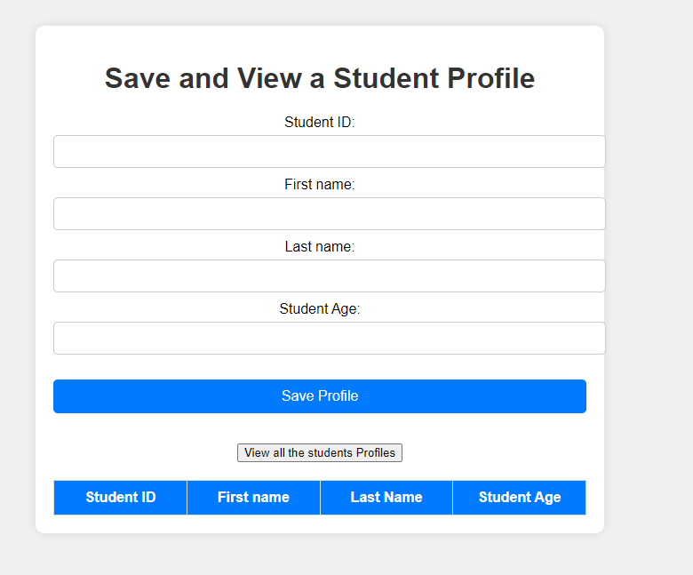

# Serverless Student Website

This project is a serverless web application where students can submit their information and view details of other students. The backend is powered by AWS Lambda functions, with static content hosted on S3 and data stored in DynamoDB. CloudFront is used as a CDN to ensure fast content delivery.

## AWS Architecture

## User Interface

## Tech Stack

- **Frontend**: Static web content hosted in an S3 bucket.
- **Backend**: 
  - Two Lambda functions:
    - **Submit Student**: Handles student form submissions, storing the data in DynamoDB.
    - **Get All Students**: Retrieves all student records from DynamoDB.
- **Database**: DynamoDB for storing student information.
- **CDN**: CloudFront for content distribution and caching, ensuring fast and reliable access.

## Features

- **Submit Student**: Users can fill in and submit their information.
- **View Students**: Users can retrieve and view a list of all submitted students.
- **Serverless Infrastructure**: The entire application is serverless, ensuring scalability and cost-effectiveness.

## How it Works

1. **Frontend**: The frontend is a static website hosted on S3, which provides the user interface for students to submit their details and view all submissions.
2. **Backend**: 
   - **Submit Lambda Function**: Triggers when a student submits their details, storing the data in DynamoDB.
   - **Get All Students Lambda Function**: Retrieves all student records and displays them on the frontend.
3. **CloudFront CDN**: Distributes the static content globally, ensuring fast access for users.

## Deployment

1. **S3**: Host the static files (HTML, CSS, JavaScript) in an S3 bucket with public read access.
2. **Lambda Functions**: Deploy two AWS Lambda functions—one for submitting student data and one for retrieving all students.
3. **DynamoDB**: Create a DynamoDB table to store student information.
4. **CloudFront**: Set up CloudFront to serve the static content from the S3 bucket, optimizing performance and delivery.

## Prerequisites

- AWS account with permissions to create S3 buckets, Lambda functions, DynamoDB tables, and CloudFront distributions.
- Basic knowledge of AWS services and serverless architecture.
